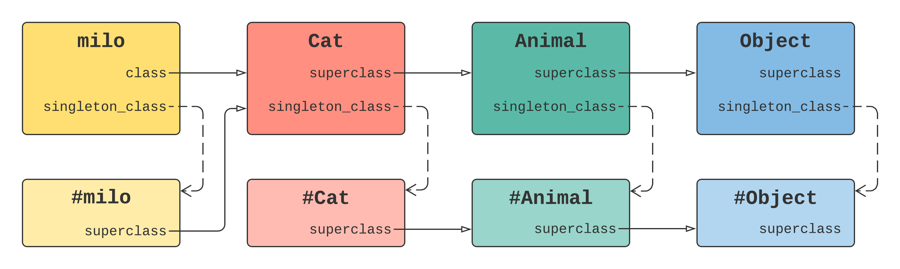

In Ruby, everything is an object, and every object has an anonymous class, which defines the methods the object can respond to. This anonymous class is called the _singleton class_.



When calling a method on an object, Ruby will perform the method lookup by first checking on the object’s _singleton class_, before traversing the rest of the method chain.

## Ruby has no class methods

The class methods are just instance methods on its _singleton class_.

```ruby
class Animal
  def self.all; end
end

Animal.singleton_methods
#=> [:all]
Animal.singleton_class.instance_method(:all)
#=> #<UnboundMethod: #<Class:Animal>#all()>
```

## The "current class"

Ruby always holds a reference to the current class, which is called "[default definee](https://blog.yugui.jp/entry/846)" by Yugui of the Ruby core team. Thus, if you define a method without giving an explicit receiver, the _current class_ will have the method as an instance method.

```ruby
class Animal
  def weight; end
end

Animal.instance_method(:weight)
#=> #<UnboundMethod: Animal#weight()>
```

If you give a receiver to a method definition, the method will be added into the _singleton class_ of the receiver.

```ruby
word = "hello"
def word.spell; end

word.singleton_class.instance_method(:spell)
#=> #<UnboundMethod: #<Class:#<String:0x00007fcda4958890>>#spell()>
```

The `class` syntax changes both `self` and the _current class_ to the class which is being defined. However, method definition doesn't.

```ruby
class Foobar
  def foo
    def bar; end
    def self.baz; end
  end
end

f = Foobar.new
f.foo

Foobar.instance_method(:foo)
#=> #<UnboundMethod: Foobar#foo()>
Foobar.instance_method(:bar)
#=> #<UnboundMethod: Foobar#bar()>
Foobar.singleton_methods
#=> []
f.singleton_methods
#=> [:baz]
```

## The eval methods

In Ruby, `instance_eval` and `class_eval` provide that provide the ability to modify a class or an object. The names are very similar, and their behavior is counterintuitive.

- Use `ClassName#instance_eval` to define a _class method_ (one associated with the class object but not visible to instances).
- Use `ClassName#class_eval` to define an _instance_ method (one that applies to all of the instances of `ClassName`).

To understand why this is true, let’s see what happens when we call the eval methods.

The `instance_eval` changes `self` to the receiver, the _current class_ to its _singleton class_.

```ruby
class Animal
  def weight; end
end

Animal.instance_eval do
  def all; end
end

Animal.instance_method(:all)
#=> NameError (undefined method `all' for class `Animal')

Animal.singleton_class.instance_method(:all)
#=> #<UnboundMethod: #<Class:Animal>#all()>
```

The `class_eval` changes both `self` and the _current class_ to the receiver.

```ruby
class Animal; end

Animal.class_eval do
  def weight; 1 end
end

Animal.instance_method(:weight)
#=> #<UnboundMethod: Animal#weight()>

Animal.new.weight
#=> 1

Animal.weight
#=> NoMethodError (undefined method `weight' for Animal:Class)
```

## Open classes

Ruby supports a concept known as "Open classes", which opens the object's _singleton class_. This is equivalent to giving a receiver a method definition.

```ruby
class Example
  class << self
    def foo; end
  end

  def self.bar; end
end

class << Example
  def baz; end
end

Example.singleton_methods
#=> [:foo, :bar, :baz]
```

Let's go through some examples:

```ruby
class Foobar; end

Foobar.instance_eval do
  self #=> Foobar
  def method_by_instance_eval; end
end

Foobar.class_eval do
  self #=> Foobar
  def method_by_class_eval; end
end

class << Foobar
  self #=> #<Class:Foobar>
  def method_by_open_class; end
end

Foobar.instance_methods
#=> [:method_by_class_eval, ...]

Foobar.singleton_methods
#=> [:method_by_instance_eval, :method_by_open_class]
```

The above context changes can be summarized in the following table:

|                   | self                            | current class                   |
| ----------------- | :------------------------------ | ------------------------------- |
| class_eval        | the receiver                    | the receiver                    |
| instance_eval     | the receiver                    | singleton class of the receiver |
| class << receiver | singleton class of the receiver | singleton class of the receiver |

## Takeaways

In Ruby,

1. everything is an object, and every object has a singleton class;
2. there are no class methods;
3. the `instance_eval` changes `self` to the receiver, the _current class_ to its _singleton class_;
4. the `class_eval` changes both `self` and the _current class_ to the receiver;
5. what "open classes" does is opening the singleton class of the receiver object.

## References

- [Understanding Ruby Singleton Classes](https://devalot.com/articles/2008/09/ruby-singleton)
- [What is the Singleton Class in Ruby?](https://maximomussini.com/posts/understanding-the-singleton-class/)
- [Self in Ruby: A Comprehensive Overview](https://airbrake.io/blog/ruby/self-ruby-overview)
- [Metaprogramming in Ruby: It's All About the Self](https://yehudakatz.com/2009/11/15/metaprogramming-in-ruby-its-all-about-the-self/)
- [Three implicit contexts in Ruby](https://blog.yugui.jp/entry/846)
- [Understanding class_eval and instance_eval](https://web.stanford.edu/~ouster/cgi-bin/cs142-winter15/classEval.php)
- [class_eval vs instance_eval - Matheus Moreira](https://stackoverflow.com/a/10306049)
- [Diving into Ruby Singleton Classes](https://medium.com/@leo_hetsch/demystifying-singleton-classes-in-ruby-caf3fa4c9d91)
